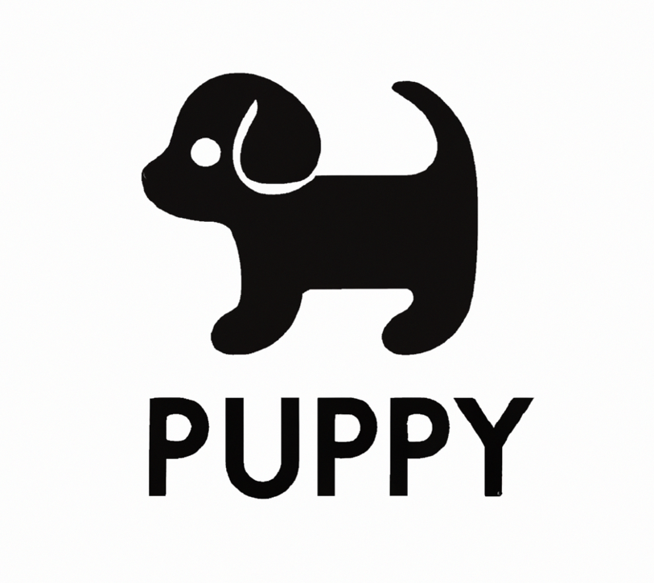

A simple python app with no flair, only function.

I created this list for my custom cabinet business. We use pickup lists for work that needs to be completed or "picked up". 
Being that they are PU lists and this is a PY script, the name Puppy seemed natural.

Features:

- create lists
- add items to, and delete items from lists
- reorder list items
- save list as pdf
- saved in local json file

Roadmap:

- [ ] improve design
- [ ] add subitems within lists
- [x] convert script to executable with dependencies bundled
- [ ] create custom installer for program

